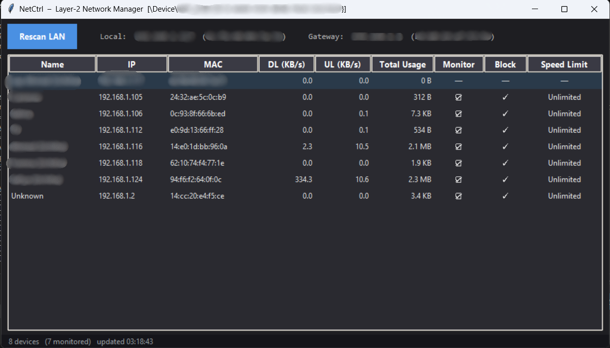

# NetCtrl

**Layer-2 LAN Bandwidth Manager**

   



## What it does

NetCtrl is a Layer-2 bandwidth management tool that uses ARP spoofing to intercept LAN traffic passing between devices on your local network and the gateway. It provides real-time download and upload speed monitoring for every device, lets you block devices from accessing the internet entirely, apply custom speed limits (in KB/s), and track cumulative total usage per device — all from a clean graphical interface.

## ⚠️ Legal & Ethical Notice

This tool is intended for **educational and personal network use only**. You should only use NetCtrl on networks that you own or have explicit permission to manage. Unauthorized interception of network traffic may violate local laws and regulations. The authors assume no liability for misuse.

## Requirements

- **Windows 10/11**
- **Python 3.10+**
- **Npcap** ([https://npcap.com](https://npcap.com)) — must be installed before running
- **Rust toolchain** ([https://rustup.rs](https://rustup.rs)) — only needed to build from source

## Installation & Setup

### Step 1 — Install Npcap

Download the installer from [npcap.com](https://npcap.com) and run it. During installation, make sure to check:

> **"Install Npcap in WinPcap API-compatible Mode"**

### Step 2 — Install Python dependencies

```bash
pip install scapy psutil requests customtkinter
```

### Step 3 — Build the Rust engine

```bash
cd rust_engine
cargo build --release
copy target\release\rust_engine.exe ..\rust_engine.exe
```

### Step 4 — Configure device names (optional)

Edit `device_names.json` to map IP addresses to friendly names. The format is shown in the template file — simply add entries like `"192.168.1.42": "Living Room TV"`.

### Step 5 — Run (as Administrator)

```bash
python main.py --rust
```

On first run, a dialog will appear asking you to select your network interface. Choose the interface connected to your LAN (WiFi or Ethernet). The selection is saved to `netctrl_config.json` for future runs.

## Features

- Real-time DL/UL speed monitoring per device
- Block internet access for any device
- Set custom speed limits (KB/s)
- Cumulative total usage tracking per device
- Automatic device name resolution (`device_names.json` → NetBIOS → mDNS → MAC)
- Your own device shown at top, protected from accidental blocking
- Interface selector on first run

## Project Structure

```
netctrl/
├── main.py                    # Entry point, launches Rust engine
├── gui.py                     # Tkinter GUI
├── device_names.json          # Your custom device name mappings
├── rust_engine/
│   ├── src/
│   │   ├── main.rs            # Rust entry point
│   │   ├── server.rs          # HTTP API server
│   │   ├── scanner.rs         # ARP network scanner
│   │   ├── spoofer.rs         # ARP poisoning engine
│   │   ├── l2_forwarder.rs    # Packet forwarding + rate limiting
│   │   └── device_registry.rs # Device state management
│   └── Cargo.toml
```

## How it works

NetCtrl uses ARP spoofing to position itself between LAN devices and the gateway. Once positioned, all traffic flows through the host machine, which enables full monitoring and control. The Rust engine handles high-speed packet forwarding with token bucket rate limiting for precise bandwidth control. The Python GUI communicates with the Rust engine over a local HTTP API running on port 8765.

## Troubleshooting

| Problem | Solution |
|---------|----------|
| "No module named netifaces" | `pip install netifaces` |
| Gateway MAC shows ?? | Run as Administrator |
| Block / speed limit not working | Run as Administrator + ensure Npcap is installed |
| Devices not appearing | Run Rescan, check interface selection |